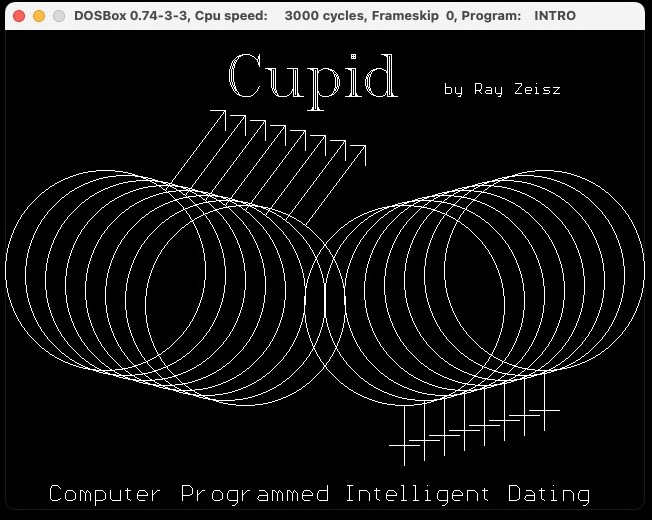

# CUPID

This is a program I wrote in 1990 as the final project for a class in Artificial Intelligence at Virginia Tech. I am releasing it publicly as a learning exercise and to demonstrate how much technology has changed in 30 years and, in some ways, how little it has.

This program implements some basic AI principles which, at the time, were cutting edge. Neural networks, expert systems, heuristics, and non-determinism in computers were not really common topics.

The program implements a system to match people, for the purposes of dating, with other users, based on their Myers-Briggs personality temperament.

The program is not rooted in science, but rather, it offers heuristics based on my, and several other friend's, experience with dating at the ripe old age of 20. The exact values assigned to the various rules of the expert system and the matching heuristic weights are not based on any real scientific work; however, the general idea of using the Myers-Briggs to build an AI was novel and not known to me, or my professor, or his wife, who taught psychology at Virginia Tech.

All source code and the README's, complete with spelling errors (there was no spell checking in Turbo Pascal in 1990) are included. A release with fully functional exe files that will run in DOSBox is also provided.

For context, this program was written on a 1987-era IBM PS/2 Model 30, with 640KB of RAM, a 20MB hard disk, and an 8MHz 8086 CPU. There was no internet at the time. Any communication we were lucky enough to have was via a telephone modem at 19,200 bps to a local BBS (Bulletin Board System).

Dr. Morton Nadler was the professor of the class. Each student was required to submit a unique final project; no two students could work on a project together, nor could two students submit a substantially similar project. We had freedom in programming language selection. At this point in college, I had used BASIC, FORTRAN, COBOL, Lisp, PROLOG, C, Pascal, 8085 assembly and 68000 assembly. I selected Pascal as my language of choice; it was like the Python of the era. Pascal had good string processing capability and was easier to debug than C. I found the "real" AI languages like Lisp and PROLOG to be horribly abstract. It is no wonder that my first job was as an embedded assembly language programmer at IBM.

For more background, and details of this project, check out my blog on [medium.com](https://medium.com/@rayzeisz/internet-dating-in-1990-e32eb414c1ce)

#### Copyright (c) Ray Zeisz 1990, 2023
